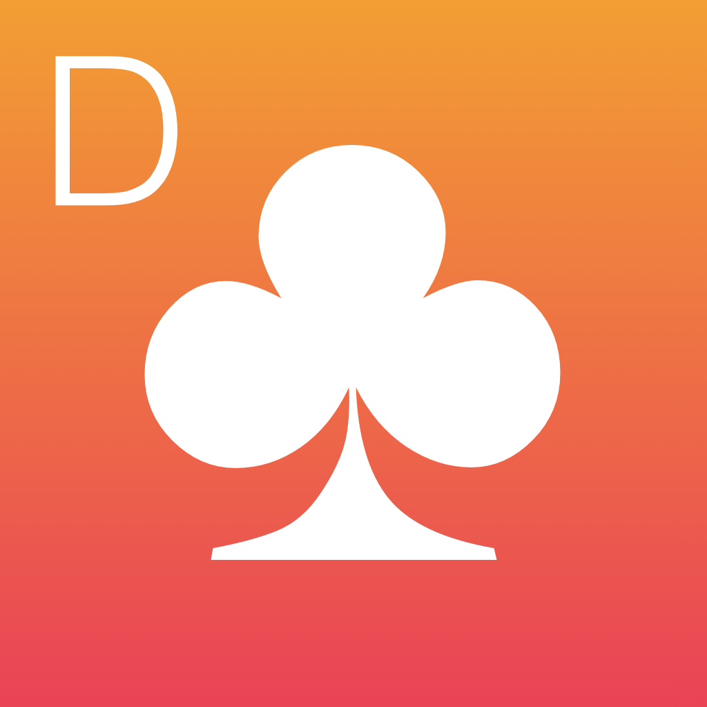

[Funktionen](#funktionen) | [Screenshots](#screenshots) |  [Support](#support)

Diese App ist die schnelle Antwort auf die Frage, die am Beginn jedes Doppelkopf-Abends steht:

#### Wer schreibt auf?

Apple, das Apple Logo, iPhone, iPad und iPod touch sind Marken der Apple Inc., die in den USA und weiteren Ländern eingetragen sind. App Store ist eine Dienstleistungsmarke der Apple Inc.

## Funktionen

Einfach das iPhone (oder ein iPad oder einen Mac) zücken, Spieltag anlegen, Karten geben und los geht’s!

**Die wichtigsten Funktionen auf einen Blick:**

1. Spielergebnisse werden sehr schnell erfasst
1. Kriddel unterstützt 4, 5 oder 6 Spieler in einer Runde 
   - bei 5 Spielern setzt der Geber im Spiel aus
   - bei 6 Spielern setzen je 2 Spieler pro Spiel aus
1. Spieltagsübersicht nach Runden mit allen wichtigen Informationen zu jedem Spiel
1. Statistik über die Anzahl der jeweils gewonnenen Spiele
1. Bockrunden werden automatisch verdoppelt
1. Spieltage sind jeweils eigenständige Dateien und können kopiert bwz. versendet werden
1. Spielergebnisse sind nachträglich korrigierbar

## Screenshots (veraltet, neue sind in Arbeit)

### Die Version für das iPhone

   

### Die Version für das iPad

   

## Datenschutz

Der Entwickler erfasst keine Daten von dieser App. This App doesn't collect any data.

## Support

Schreiben Sie [uns](mailto:support@schreibauf.schreib.name) eine eMail.
